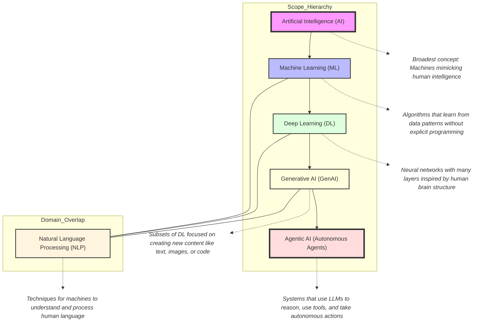

```mermaid
graph TD
    AI["Artificial Intelligence (AI)"]
    ML["Machine Learning (ML)"]
    DL["Deep Learning (DL)"]
    NLP["Natural Language Processing (NLP)"]
    GenAI["Generative AI (GenAI)"]
    AgenticAI["Agentic AI (Autonomous Agents)"]

    subgraph Scope_Hierarchy
        AI --> ML
        ML --> DL
        DL --> GenAI
        GenAI --> AgenticAI
    end

    subgraph Domain_Overlap
        ML --- NLP
        DL --- NLP
        GenAI --- NLP
    end

    AI_Description["Broadest concept: Machines mimicking human intelligence"]
    ML_Description["Algorithms that learn from data patterns without explicit programming"]
    DL_Description["Neural networks with many layers inspired by human brain structure"]
    NLP_Description["Techniques for machines to understand and process human language"]
    GenAI_Description["Subsets of DL focused on creating new content like text, images, or code"]
    AgenticAI_Description["Systems that use LLMs to reason, use tools, and take autonomous actions"]

    AI -.-> AI_Description
    ML -.-> ML_Description
    DL -.-> DL_Description
    NLP -.-> NLP_Description
    GenAI -.-> GenAI_Description
    AgenticAI -.-> AgenticAI_Description

    style AI fill:#f9f,stroke:#333,stroke-width:4px
    style ML fill:#bbf,stroke:#333,stroke-width:2px
    style DL fill:#dfd,stroke:#333,stroke-width:2px
    style NLP fill:#fff4dd,stroke:#333,stroke-width:2px
    style GenAI fill:#ffd,stroke:#333,stroke-width:2px
    style AgenticAI fill:#fdd,stroke:#333,stroke-width:4px

    style AI_Description fill:none,stroke:none,font-style:italic
    style ML_Description fill:none,stroke:none,font-style:italic
    style DL_Description fill:none,stroke:none,font-style:italic
    style NLP_Description fill:none,stroke:none,font-style:italic
    style GenAI_Description fill:none,stroke:none,font-style:italic
    style AgenticAI_Description fill:none,stroke:none,font-style:italic
```